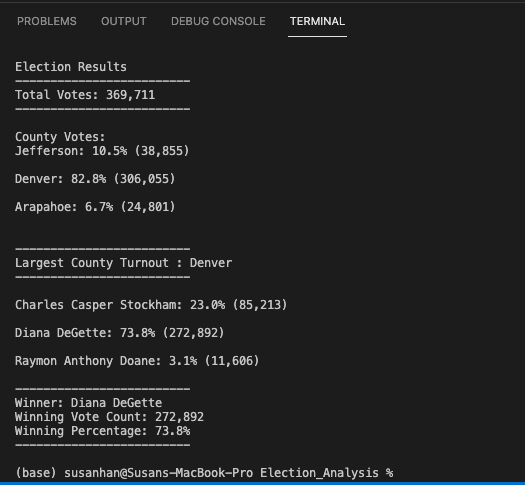
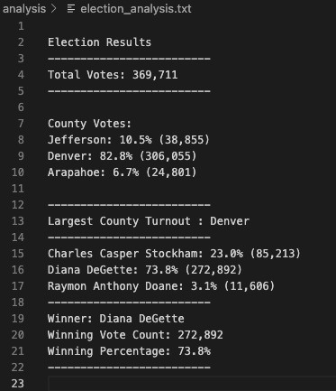
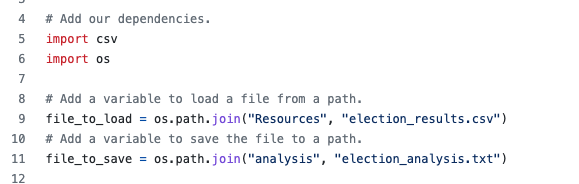
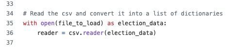
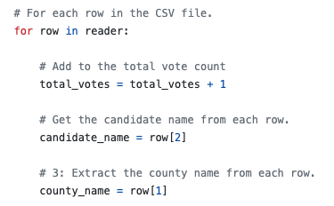

# Election_Analysis 

## Project Overview
The project is to assist a Colorado Board of Elections employee to complete an election audit of tabulated results for a recent local congressional election in Colorado.

The primary objective are to complete the following tasks using python:

  1) calculate the total number of votes count.
  2) get a complete list of candidates who received votes.
  3) calculate the total number of votes each candidate received.
  4) calculate the percentage of votes each candidates won. 
  5) determine the winner of the election based on popular vote. 

Besides the main tasks given above, we were also asked to analyze some addtional data related to voter's counties:

  1) calculate the voter turnout for each county.
  2) calculate the percentage of votes from each ounty out of the total count.
  3) determine the county with the highest turnout.

## Resources
- Data Source: election_results.csv
- Software: Python 3.8.8, Visusal Studio Code 1.63.0

## Results

We have found the following results for our election-audit analysis:

- there were total 369,711 votes cast in the election.

- the candidates were：
 
  - Charles Casper Stockham
  - Diana DeGette
  - Raymon Anthony Doane

- the votes were collected from counties
  
  - Jefferson 
  - Denver  
  - Arapahoe

- out of the three counties:

  - Jefferson county received 10.5% of the vote and 38,855 number of votes.
  - Denver county received 82.8% of the vote and 306,055 number of votes.
  - Arapahoe county received 6.7% of the vote and 24,801 number of votes.

- the county that had the largest number of votes:

  - **Denver county**, which had 306,055 number of votes
  
- the candidates results were：

  - Charles Casper Stockham received 23.0% of the vote and 85,213 number of votes.
  - Diana DeGette received 73.8% of the vote and 272,892 number of votes.
  - Raymon Anthony Doane received 3.1% of the vote and 11,606 number of votes.

- the winner of the election was:

  - **Diana DeGette**, who received 73.8% of the vote and 272,892 number of votes.

The results are printed to TERMINAL and are written to election_analysis.txt file

## Election-Audit Summary

- This is a great script that could be easily modified and applied to any other election analysis. First of all, we could use the current functions (shown as below) to load and read any csv file as long as we could appoint a path to the file. 

- Next, depends on the data we are working with, we could simply amend the row[index] number to locate candidate names and region names in the functions (shown below). Also, if it is for analyzing a federal election data we may amend the county variables, such as the *county_name* variable to provinces or states.

